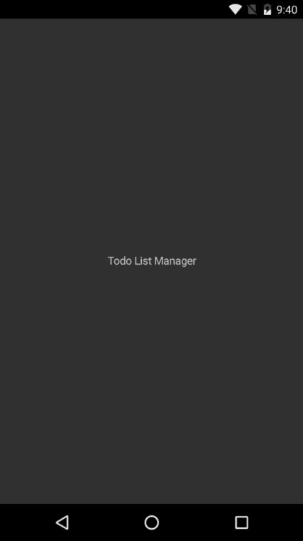

# **Solution:** Design an User Interface Using a C# Class



## Project Files

### HomePage.cs

First you should create a new C# class named **HomePage.cs**. This class simply sets the value of it's **Content** property. For readability purposes, I placed the code that builds the UI in a separate method.

```c#
using Xamarin.Forms;

namespace MobileBootcamp
{
    public class HomePage : ContentPage
    {
        public HomePage()
        {
            BuildContent();
        }

        private void BuildContent()
        {
            this.Content = new StackLayout
            {
                VerticalOptions = LayoutOptions.Center,
                Children = {
                        new Label {
                            HorizontalTextAlignment = TextAlignment.Center,
                            Text = "Todo List Manager"
                        }
                    }
            };
        }
    }
}
```

### App.cs

In the **App** class, you should remove a lot of the boiler plate code and simply set the **MainPage** property to an instance of the *HomePage* class.

```c#
using Xamarin.Forms;

namespace MobileBootcamp
{
    public class App : Application
    {
        public App()
        {
            this.MainPage = new HomePage();
        }
    }
}
```

## Visual Studio Solution

[You can always view the entire Visual Studio solution](solution/).
