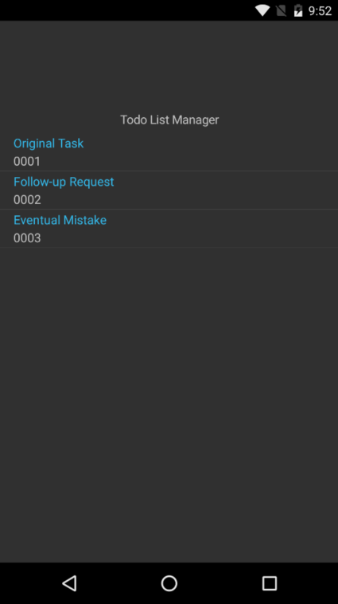

# **Solution:** Render a Collection of Data Using The ListView and TextCard Classes



## Project Files

### Data/TodoItem.cs

This class is a simple representation of a *Todo Item* with two properties.

```c#
namespace MobileBootcamp.Data
{
    public class TodoItem
    {
        public string Id { get; set; }

        public string Text { get; set; }
    }
}
```

### HomePage.cs

In this class, we created a template and a list of items and then used both as part of a *ListView* in our *StackLayout*.

```c#
private void BuildContent()
{
    List<TodoItem> todoItems = new List<TodoItem>
    {
      new TodoItem { Id = "0001", Text = "Original Task" },
      new TodoItem { Id = "0002", Text = "Follow-up Request" },
      new TodoItem { Id = "0003", Text = "Eventual Mistake" }
    };

    DataTemplate todoTemplate = new DataTemplate(typeof(TextCell));
    todoTemplate.SetBinding(TextCell.TextProperty, "Text");
    todoTemplate.SetBinding(TextCell.DetailProperty, "Id");

    this.Content = new StackLayout
    {
        VerticalOptions = LayoutOptions.Center,
        Children =
        {
            new Label
            {
                HorizontalTextAlignment = TextAlignment.Center,
                Text = "Todo List Manager"
            },
            new ListView
            {
                ItemsSource = todoItems,
                ItemTemplate = todoTemplate
            }
        }
    };
}
```

## Visual Studio Solution

[You can always view the entire Visual Studio solution](solution/).
